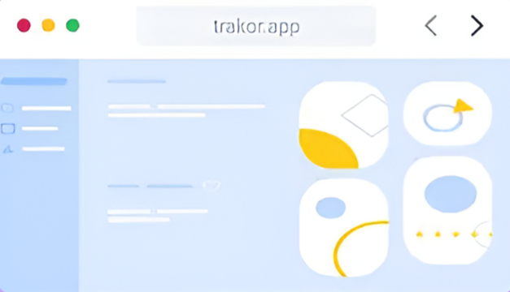

# 🚀 Wrapp – Landing Page UI

Wrapp is a clean, modern, and fully responsive landing page UI built using **React + Vite** with **custom CSS**. It features smooth animations, elegant transitions, and a consistent purple-themed aesthetic inspired by modern SaaS marketing websites.

## 🌟 Features

- 🎨 Beautiful, gradient-based design
- 💜 Consistent purple theme
- 🖼️ Hero section with CTA and image
- 📱 Fully responsive on all devices
- ✨ Smooth hover effects and entrance animations
- 📦 Built with Vite for super fast development
- 🦄 Custom CSS (no Tailwind/Bootstrap)
- 📃 Clean footer layout

## 📸 Preview

  
*Full mockup image in `src/assets` folder*


---

## 🧰 Tech Stack

- ⚛️ React (with Vite)
- 🎨 CSS (custom, no frameworks)
- 🖼️ Local assets and static images
- 💻 Responsive and accessible HTML5

---

## 🚀 Getting Started

### 1. Clone the Repository

```bash
git clone https://github.com/MustafaRaheel26/interview-landing-1.git
cd interview-landing-1
